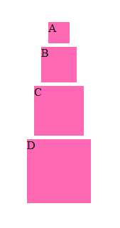

# Casscade - (Experimental) Cassowary constraint-based layouts using Houdini CSS layout worklets

This is a **very, very experimental**, borderline **proof of concept** implementation of
[Houdini layout worklets for CSS](https://github.com/w3c/css-houdini-drafts/blob/main/css-layout-api/EXPLAINER.md)
that provide linear constraint solving for block containers with block children.

At the time of writing, the system is quite crude. There is no developer sugar,
so the constraints are quite verbose.

The parent element is given `display: layout(casscade)`, and each child is given
a `--name: some-name` property. The parent then defines `--rule: ...`, where `...`
is a set of linear constraints.

The constraint syntax sports complete expression parsing and can refer to child
elements directly by their `--name`s. The terminating identifier in a term must
be a symbol - a built-in variable supplied by Casscade.

All element names must be lowercase. All symbols are uppercase.

Symbols include:

-   `L`, `R`, `T` and `B` for left/right/top/bottom respectively
-   `W` and `H` for width/height
-   `M` and `C` for (vertical) middle and (horizontal) center, respectively

These symbols can then be used in the `--rule` constraints to relate element
metrics to one another.

For example, to position `#lower` below `#upper` with 5 pixels of vertical
gap and align their horizontal centers, one might write the following styles:

```css
#parent > #upper { --name: upper; }
#parent > #lower { --name: lower; }

#parent {
	display: layout(casscade);

	--rule:
		/* baseline positioning */
		upper.L == 0, upper.T == 0,

		/* vertical positioning */
		lower.T == upper.B + 5,

		/* align centers */
		lower.C == upper.C;
}
```

The example in this repository should render like the following:



## Building

Clone, `npm i` and then `npm run build`. Serve with your favorite static
web server.

You'll need a browser listed as supporting some version of the Layout API.
A list can be found on [ishoudinireadyyet.com](https://ishoudinireadyyet.com/).

# License

Casscade is released under the [MIT License](LICENSE.txt).
